# Yolo v3

## Table of Content
**[Execution](#execution)**<br>
**[Data Augmentation](#data-augmentation)**<br>
**[Network Architecture](#network-architecture)**<br>
**[Loss Function](#loss-function)**<br>
**[COCO Dataset Dataloader Metrics](#coco-dataset-dataloader-metrics)**<br>
**[Training](#training)**<br>
**[Results](#results)**<br>

## Execution

Setup pip environment
```
pip3 install pip --upgrade
python3.8 -m venv --system-site-packages ./mlenv
source ./mlenv/bin/activate
pip install pip --upgrade
pip install -r requirements.txt
```

Download Darknet pretrained weights (darknet53.conv.74)
```
yolo-v3/models/weights/download_darknet_weights.sh
```

Start training, pipe consol output into nohup_0.out
```
nohup python3 yolo-v3/main.py --gpu 0 > nohup_0.out &
```

Check last 10 lines of console output in the nohup_0.out file
```
tail -f nohup_0.out
```

Check which threads are executing your code (useful for killing thread to end training)
```
ps -ef | grep python3
```

Scripts for validating a model, visualizing a dataset and overfitting on a batch
```
validation.py
visualization.py
batch_overfit.py
```

Tools for exporting a model, plotting custom lr_schedulers and visualizing an augmented batch
```
export.py
lr_scheduler_creator.py
visualize_batch.py
```

Downloading pretrained weights, training logs and training configs. The downloaded .zip files
should be unzipped and placed in the logs directory
```
# 240224-21:17:13_LambdaLR:
https://drive.google.com/file/d/1Z0NrNtSfIEXsiv-yqw8dKDFFPAKyrbdG/view?usp=sharing

# 240308-08:21:01_CosineAnnealing_T1:
https://drive.google.com/file/d/1Tq7lmbJDToszPKBcbEqsAKD2zGr62E6V/view?usp=sharing

# 240312-22:29:21_CosineAnnealing_T2:
https://drive.google.com/file/d/1Km_xFPEnbxRM8ZWsk1D__dxwle13E5hG/view?usp=sharing
```

View tensorboard logs in logs directory
```
tensorboard --logdir logs/
```

## Data Augmentation

Data augmentation was done using the Albumentations library. This library support image and bbox augmentation, allowing
the use of sophisticated geometric augmentations.

Augmentations used:  
*MultiplicativeNoise, CLAHE, Posterize, ToGray, RandomBrightnessContrast, RGBShift, ColorJitter, GaussNoise, RandomFog
HorizontalFlip, Affine, Resize*

The images were normalized using the official mean and std calculated for imagenet. This is what is used for training
official pytorch feature encoders are trained on, as well as the Darknet encoder used in this project. The empty regions
left behind due to geometric augmentation for the training images and the letter-box augmentation for the validation
images was also filled with the previously mentioned mean pixel value (grey). This was done to avoid shifting the mean
of the dataset by using black or white pixel values.

<p align="center">
  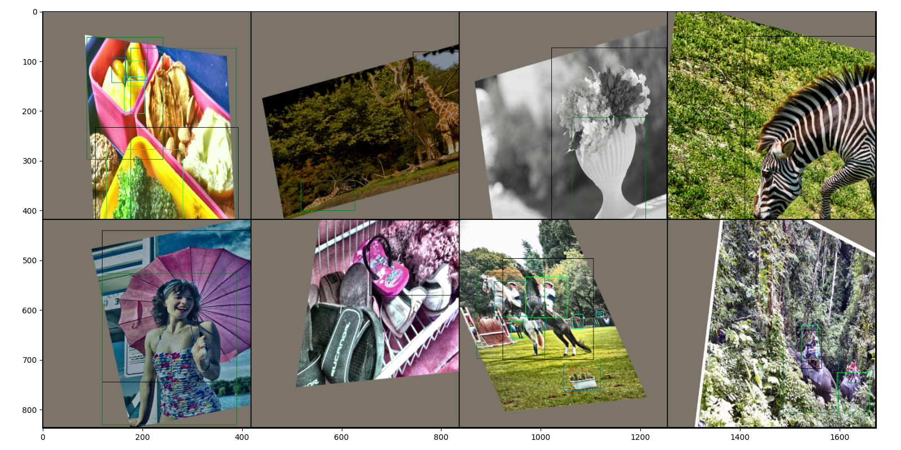
</p>
<p align="center">
  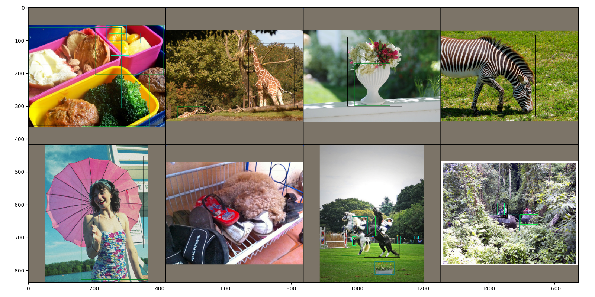
</p>

## Network Architecture

### Darknet
The Darknet feature encoder used in the original paper is not available in the pytorch model zoo with pretrained weights.
This was circumvented by gutting a python script created by ultralytics to parse and load the Darknet part of the Yolo v3
architecture. This script now provides Darknet as a class derived from nn.Module with the option to load pretrained weight.
This class is also used to provide access to earlier layers of the encoder, which are used to create route connection.

External files used to pythonize Darknet:

* Building Darknet graph in Pytorch: This file builds the entire yolo graph. Since I only needed to it to create the Darknet
encoder's graph, I stripped out all the unneccessary code:   
https://github.com/ultralytics/yolov3/blob/archive/models.py
* Darknet config file. This file describes the yolo architecture and is used by the script above. I removed the non-darknet parts:   
https://github.com/ultralytics/yolov3/blob/archive/cfg/yolov3.cfg
* Darknet weights: This file contains the official weights pretrained on ImageNet:   
https://pjreddie.com/media/files/darknet53.conv.74
* Darknet weight loader: The exact origin of this plagiarized file has been lost to time. There seems to be a lot of them. This one is very similar:   
https://github.com/ghimiredhikura/Complex-YOLOv3/blob/master/models.py


### Yolo v3
The tail and heads of the yolo architecture were implementation primarily using the following image:
<p align="center" >
  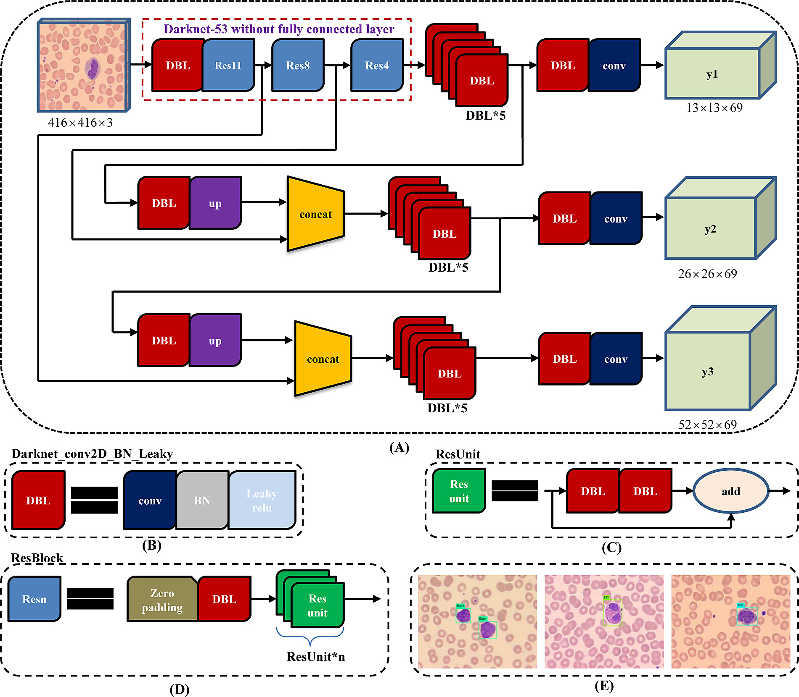
</p>
Source: https://plos.figshare.com/articles/figure/YOLOv3_architecture_/8322632/1

## Loss Function 
The Loss function was heavy inspired by the implementation below. The function was significantly refactored to use newer
pytorch functions, use BCEWithLogitsLoss() instead of BCELoss() to support mixed precision training, and perform
the majority of operation on GPU. The BCELoss() used for class classification was change to CrossEntropyLoss() as dictated
by the original paper, but was reverted due to no benefit being seen. It is assumed this is due to the COCO dataset being
single label per detection, negating the benefits of cross entropy.

Source: https://github.com/eriklindernoren/PyTorch-YOLOv3   
Source: https://github.com/DeNA/PyTorch_YOLOv3

The anchor boxes determined by K-means clustering in the original paper for the COCO dataset were repurposed in this implementation.

<p align="center" >
  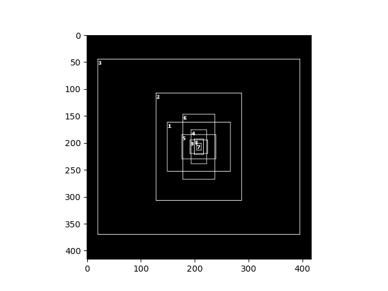
</p>

## COCO Dataset Dataloader Metrics
### COCO Dataset (2017)

The 2017 version of the COCO dataset was used. This containes the same images as the 2014 version, but partitioned
differently between train and val.
* Training: 2017 Train images [118K/18GB]
* Validation: 2017 Val images [5K/1GB]

### Dataloader
The implemented dataloader is derived from the CocoDetection class in torchvision.datasets. The removed the need to parse
the .yaml file in which the labels are stored. The dataloader augments and preprocessed the images and labels. One functionality it
provides is multiscale training of images, which is used by the original paper to makes the network scale invariant.

### COCO Metrics
Evaluation of the predictions was done using the official pycocotools library, with the target metric to maximalize being the following:
<p style="text-align: center;">Average Precision (AP) @[ IoU=0.50 | area=all | maxDets=100 ]</p>
This metric is calculated in the same way as defined in the Pascal VOC challenge. An explanation on how this is calculated can be found here:  
https://kharshit.github.io/blog/2019/09/20/evaluation-metrics-for-object-detection-and-segmentation  
A peculiarity of this mAP is that AP's unweighted average is calculated acorss classes. This means that bad performance 
on any given class will severely impact the final results. If a dataset is biases, particular attention should be payed 
to balance the dataset during training by oversampling or weighting the training data. Looking at logarithmic distribution
of the COCO dataset, most classes are generally equally represented, however a few outlier classes (e.g. hairbrush) suggest
that weighting the training data would benefit the mAP metric.

<p align="center">
  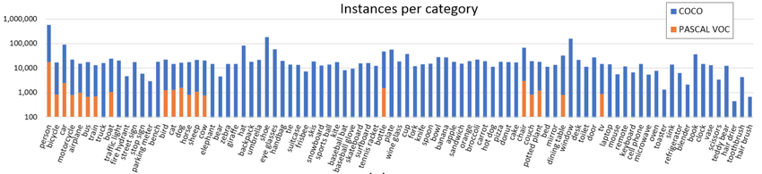
</p>

## Training
I tried lots of stuff while working on YOLOv3. A lot of it didn’t work. Here’s the stuff I can remember.

### Learning Rate Scheduler
The original yolo v3 used SGD optimization, and drop the lr from 1e-3 by a 0.1 multiplier at 400k/500k and 450k/500k cycles.
Based on general internet wisdom, I opted to use the ADAM optimizer. This has some benefit, e.g. people seem to struggle with
SGD causing exploding gradients when neglecting to use "warmup" and/or freezing the pretrained encoder at the beginning of
transfer learning, something ADAM seems to be immune to. As the debate on ADAM benefiting from learning rate scheduling is ongoing,
I tried a few to test the results.

(Red: CosineAnnealingWarmRestartsWithWarmup (T=2), Blue: CosineAnnealingWarmRestartsWithWarmup (T=1), Green: LambdaLR). In all three
cases, an exponential warmup was used to negate the affects of the larger gradients in the untrained neck destroying the
gradients in the pretrained tail. I could also have frozen the gradient of the tail for a few epochs, but this seems to be
redundant.

<p align="center">
  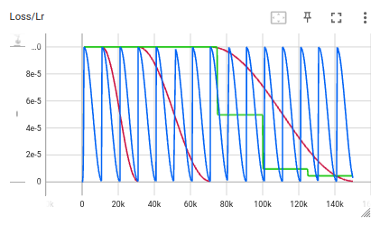
  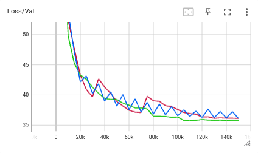 
  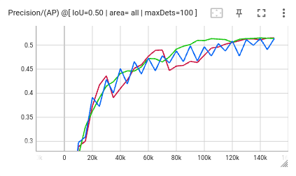
</p>

### Mixed Precision
This has a lot of rules on how it may be used and what hardware benefits, so I am lucky that it seems to work. Not all GPUs
support fp16 operations, but it seems that I can double by batch size by using this. It may turn out that the batch takes
twice as long to process.

### Gradient Accumulation
The original yolo v3 implementation trains on a batch size of 64. Reducing batch size would result noisy gradients, so that
is not an option. Accumulating the gradients is a workaround to training larger batched on small GPUs. In the link below there
is an official explanation on how to do gradient accumulation when also using mixed precision. Naturally, I implemented it
incorrectly before reading the documentation and fixing it, only to realized I run out of memory, so I reverted it to the faulty
implementation. While the gradient accumulation works, the training was done with the original batch size of 64.

https://pytorch.org/docs/stable/notes/amp_examples.html

### Early Stopping
To prevent overwriting the current best checkpoint with suboptimal weights do to overfitting, some boilerplate code ensures
that new checkpoints are only made when the mAP metric surpasses the previous best. Intuitively, it might make sense to use
the validation loss for this purpose, however this is not the case. Losses which contain margins of some kind, e.g. Hinge
loss, or in this case, BCEWithLogitsLoss, may produce higher validation metrics even then the validation loss has started
to overfit. Specifically in this case, the net may have started to overfit on the most common "person" class while still
learning/improving the least common "hairbrush" class.

### Multiscale Training
The repository supports multiscale training. This randomly chooses an image size between 320 and 608 with a step size
of 32 (this is needed so that the route connection doesn't try to concat an odd and even shaped tensor, since upsample
will always result in even numbers). This solution also converged correctly and could produce 2% mAP improvement
when running on 608x608 sized images, as expected based on the original paper. The downside is that no significant improvement
was visible on 416x416 images, and training was slower, so this was not used while running further experiments.

## Results

The saving logic always saves the weights based on the best MAP IoU=0.5. The highest MAP achieved this way was chosen to
be the final result (see below). Since the MAP expects all boxes to be provided regardless of confidence. Usually, a very small
cutoff confidence threshold is set to filter out the background predictions. It is unclear what threshold the original authors used
I try different thresholds to see their affect:

Weights used: 240224-21:17:13_LambdaLR  
Training iterations: 150k (Original is 500k)  

Confidence Threshold: 0.01  
Found Boxes: 201097  
```
Average Precision  (AP) @[ IoU=0.50:0.95 | area=   all | maxDets=100 ] = 0.262
Average Precision  (AP) @[ IoU=0.50      | area=   all | maxDets=100 ] = 0.495 <-
Average Precision  (AP) @[ IoU=0.75      | area=   all | maxDets=100 ] = 0.257
Average Precision  (AP) @[ IoU=0.50:0.95 | area= small | maxDets=100 ] = 0.098
Average Precision  (AP) @[ IoU=0.50:0.95 | area=medium | maxDets=100 ] = 0.284
Average Precision  (AP) @[ IoU=0.50:0.95 | area= large | maxDets=100 ] = 0.399
Average Recall     (AR) @[ IoU=0.50:0.95 | area=   all | maxDets=  1 ] = 0.234
Average Recall     (AR) @[ IoU=0.50:0.95 | area=   all | maxDets= 10 ] = 0.351
Average Recall     (AR) @[ IoU=0.50:0.95 | area=   all | maxDets=100 ] = 0.370
Average Recall     (AR) @[ IoU=0.50:0.95 | area= small | maxDets=100 ] = 0.179
Average Recall     (AR) @[ IoU=0.50:0.95 | area=medium | maxDets=100 ] = 0.395
Average Recall     (AR) @[ IoU=0.50:0.95 | area= large | maxDets=100 ] = 0.526
```

Confidence Threshold: 0.001  
Found Boxes: 628352  
```
Average Precision  (AP) @[ IoU=0.50:0.95 | area=   all | maxDets=100 ] = 0.264
Average Precision  (AP) @[ IoU=0.50      | area=   all | maxDets=100 ] = 0.501 <-
Average Precision  (AP) @[ IoU=0.75      | area=   all | maxDets=100 ] = 0.258
Average Precision  (AP) @[ IoU=0.50:0.95 | area= small | maxDets=100 ] = 0.099
Average Precision  (AP) @[ IoU=0.50:0.95 | area=medium | maxDets=100 ] = 0.286
Average Precision  (AP) @[ IoU=0.50:0.95 | area= large | maxDets=100 ] = 0.402
Average Recall     (AR) @[ IoU=0.50:0.95 | area=   all | maxDets=  1 ] = 0.236
Average Recall     (AR) @[ IoU=0.50:0.95 | area=   all | maxDets= 10 ] = 0.363
Average Recall     (AR) @[ IoU=0.50:0.95 | area=   all | maxDets=100 ] = 0.390
Average Recall     (AR) @[ IoU=0.50:0.95 | area= small | maxDets=100 ] = 0.199
Average Recall     (AR) @[ IoU=0.50:0.95 | area=medium | maxDets=100 ] = 0.421
Average Recall     (AR) @[ IoU=0.50:0.95 | area= large | maxDets=100 ] = 0.541
```

Confidence Threshold: 0.0001
Found Boxes: 1547498   
```
Average Precision  (AP) @[ IoU=0.50:0.95 | area=   all | maxDets=100 ] = 0.264
Average Precision  (AP) @[ IoU=0.50      | area=   all | maxDets=100 ] = 0.502 <-
Average Precision  (AP) @[ IoU=0.75      | area=   all | maxDets=100 ] = 0.258
Average Precision  (AP) @[ IoU=0.50:0.95 | area= small | maxDets=100 ] = 0.099
Average Precision  (AP) @[ IoU=0.50:0.95 | area=medium | maxDets=100 ] = 0.286
Average Precision  (AP) @[ IoU=0.50:0.95 | area= large | maxDets=100 ] = 0.402
Average Recall     (AR) @[ IoU=0.50:0.95 | area=   all | maxDets=  1 ] = 0.236
Average Recall     (AR) @[ IoU=0.50:0.95 | area=   all | maxDets= 10 ] = 0.367
Average Recall     (AR) @[ IoU=0.50:0.95 | area=   all | maxDets=100 ] = 0.398
Average Recall     (AR) @[ IoU=0.50:0.95 | area= small | maxDets=100 ] = 0.207
Average Recall     (AR) @[ IoU=0.50:0.95 | area=medium | maxDets=100 ] = 0.433
Average Recall     (AR) @[ IoU=0.50:0.95 | area= large | maxDets=100 ] = 0.549
```

### Alternative Backbones
An ablation study was done to see the affects of using mobilenet_v3_large and mobilenet_v3_small compared to darknet.
The backbones can be set using yolo.encoder parameter in args.yaml (see args.yaml for clarification). The models were not trained
for the same number of iterations, but they sufficiently converged to provide a realistic estimate of their difference.


Backbone|Plot|Max MAP IoU=0.5.|
---|---|---|
darknet|red|0.4967
mobilenet_v3_large|purple|0.4340
mobilenet_v3_small|yellow|0.3349


<p align="center">
  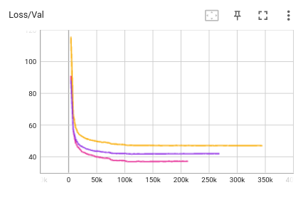
  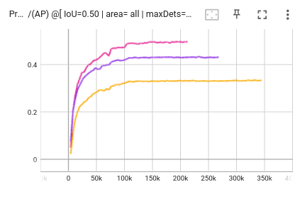 
  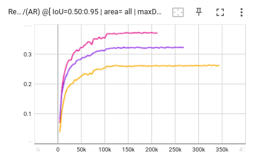
</p>
